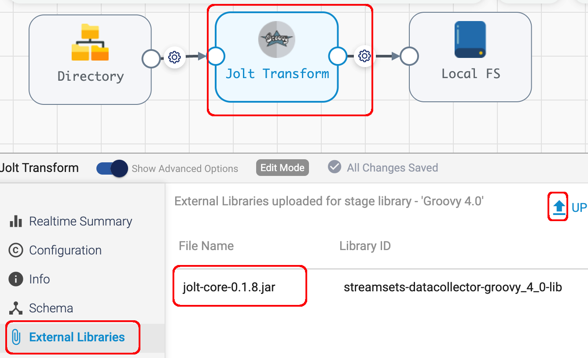

## streamsets_jolt_transforms

This project provides an example StreamSets pipeline with a Groovy Processor that implements [Jolt Transforms](https://github.com/bazaarvoice/jolt).

The project's example JSON input, output, and spec files have been taken directly from the Jolt project's [Getting Started](https://github.com/bazaarvoice/jolt/blob/master/gettingStarted.md) file.

### Prerequisites

- Maven is needed to build the Jolt jar file

- The Groovy 4.0 StreamSets stage lib

### Build the Jolt project

- Clone the [Jolt Project](https://github.com/bazaarvoice/jolt) to your local machine

- Switch to the root of the project and build it:

	<code>$ mvn package -DskipTests</code>
	
- This will generate the two jar files we will import into the Groovy stage:
 ```
		jolt-core/target/jolt-core-0.1.9-SNAPSHOT.jar
		json-utils/target/json-utils-0.1.9-SNAPSHOT.jar
	
```

### Import the example pipeline

Import the example [pipeline](/pipelines).  The pipeline looks like this:


&nbsp;&nbsp;&nbsp;&nbsp;&nbsp;&nbsp;&nbsp;&nbsp;&nbsp;&nbsp;&nbsp;&nbsp;

### Import the two Jolt jar files into the Groovy Stage:

&nbsp;&nbsp;&nbsp;&nbsp;&nbsp;&nbsp;&nbsp;&nbsp;&nbsp;&nbsp;&nbsp;&nbsp;

Make sure to restart the engine after adding the jar files.

### Set pipeline parameters

Set the pipeline parameters including the JSON input and output directories and the Jolt spec file:

&nbsp;&nbsp;&nbsp;&nbsp;&nbsp;&nbsp;&nbsp;&nbsp;&nbsp;&nbsp;&nbsp;&nbsp;


### Preview the pipeline

Preview the pipeline and confirm the transform is working:

&nbsp;&nbsp;&nbsp;&nbsp;&nbsp;&nbsp;&nbsp;&nbsp;&nbsp;&nbsp;&nbsp;&nbsp;

### Implementation Notes:

The Groovy Processor's init script runs only once, at pipeline startup. This script initializes a Jolt <code>chainr</code> from the Jolt Spec file and saves it in the global cache.

The Groovy Processor's main script uses the cached <code>chainr</code> to apply the transform from the Jolt spec file to each record, overwriting the input JSON with the output JSON.
